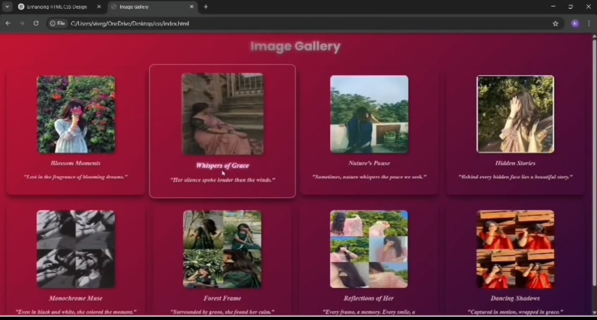

# 🌌 Image Gallery Website

A beautifully designed **Image Gallery** website created using **HTML** and **CSS**.  
This single-page project showcases a collection of curated images with stylish **hover effects**, titles, and poetic quotes — all set on a modern dark-gradient background.

---

## 🔮 Features

- 🎨 Eye-catching **hover effects** on image cards  
- 🖼️ Titles and **descriptive captions** below each image  
- 🌈 Elegant and aesthetic gradient background  
- 💻 Fully responsive single-page design  
- 🌐 Built using only HTML and CSS — no frameworks!

---

## 📸 Screenshot

---

## 📺 Demo Video

▶️ [Watch the Demo](https://drive.google.com/uc?export=download&id=1UDkcj6lGFi-S68SOFdC8irJMHDR5_hJj)

---

## 💻 Technologies Used

- HTML5  
- CSS3  

---

## 🚀 GitHub Pages Link

🌐 [View Live Website](https://nivetha0411.github.io/image-gallery/)

---

## 📂 Project Structure

